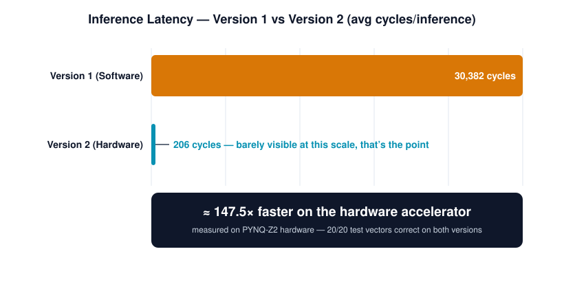
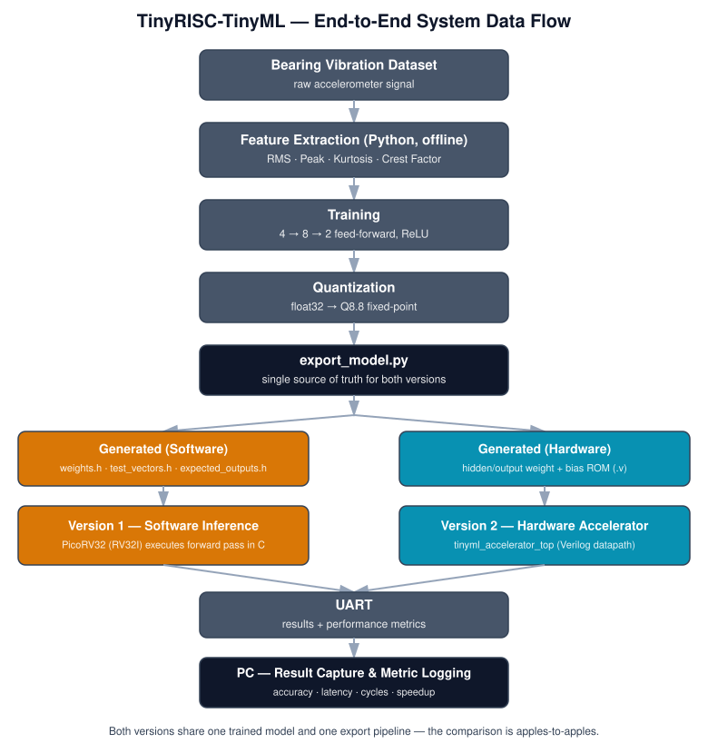
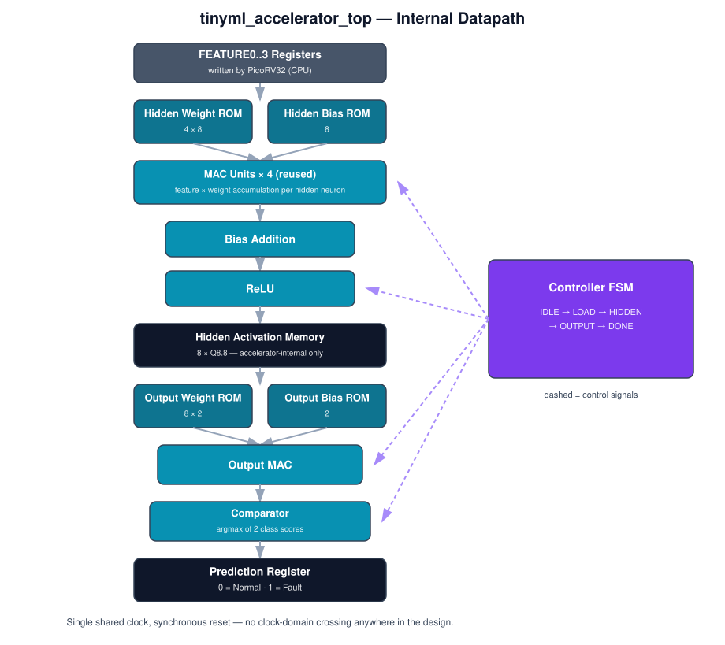
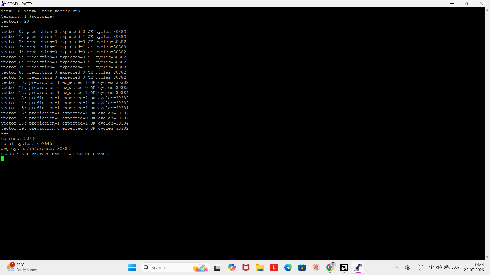
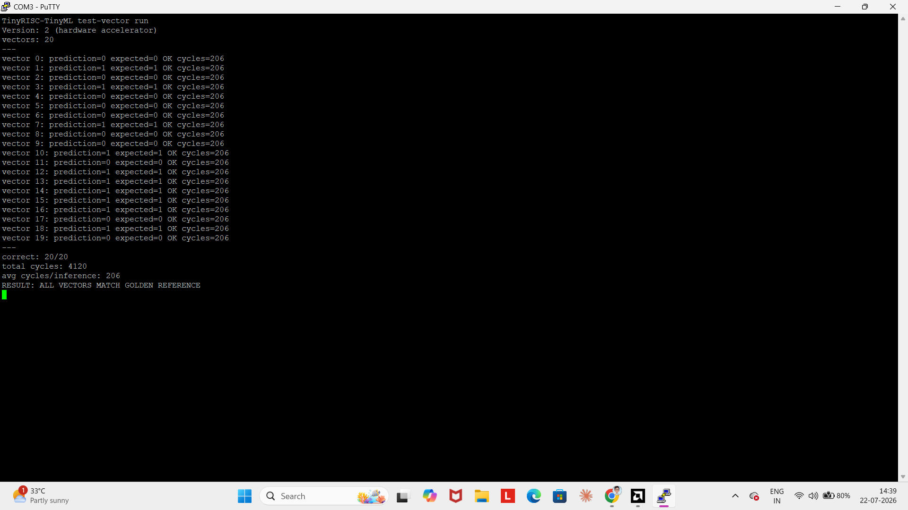
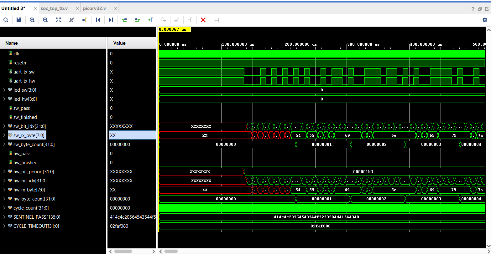
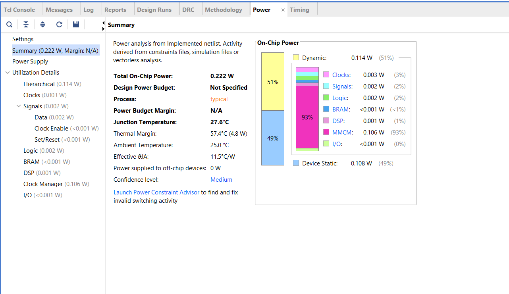
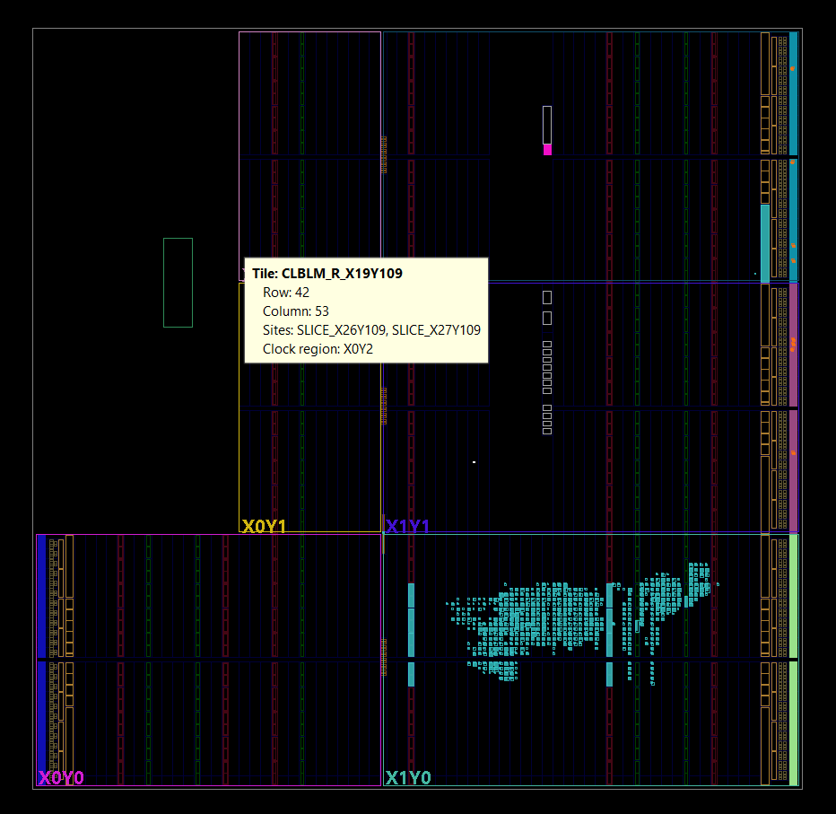

# TinyRISC-TinyML

**FPGA-Based Bearing Fault Detection using PicoRV32 and a Custom TinyML Hardware Accelerator**

TinyRISC-TinyML is an FPGA-resident embedded machine learning system built on the Xilinx **PYNQ-Z2** (Zynq-7020) board. It performs real-time classification of rotating-machinery bearing condition (**Normal vs. Fault**) from four vibration-derived features, using a small feed-forward neural network (**4 → 8 → 2**, ReLU, Q8.8 fixed-point).

The core of the project is a controlled, apples-to-apples comparison between two ways of running the *same trained model* on the *same chip*:

| | Version 1 — Software | Version 2 — Hardware |
|---|---|---|
| Executes on | PicoRV32 (RV32I soft core) | Custom Verilog accelerator (`tinyml_accelerator_top`) |
| Language | C | Verilog RTL |
| Role of PicoRV32 | Runs the entire forward pass | Stays as system controller; writes features, polls status |

Both versions are generated from a single trained model and a single export script, so the comparison isolates **one variable** — where the inference runs — while everything else (weights, test vectors, board, clock) stays identical.



## Architecture

**End-to-end data flow**, from raw vibration signal to on-board result:



**Inside the accelerator** — the Verilog datapath that Version 2 offloads the forward pass to:



## Tech Specs

| | |
|---|---|
| Target board | Xilinx PYNQ-Z2 (XC7Z020CLG400-1, Zynq-7000) |
| CPU core | PicoRV32, RV32I |
| Network topology | 4 → 8 → 2, feed-forward, ReLU |
| Input features | RMS, Peak, Kurtosis, Crest Factor |
| Arithmetic | Q8.8 fixed-point (16-bit) |
| CPU ↔ accelerator link | Memory-mapped registers, polled (no interrupts, no AXI/DMA) |
| Clocking | Single shared clock, synchronous reset — no CDC in the design |
| Toolchain | Python 3 (training/export) · GNU RISC-V GCC (firmware) · Xilinx Vivado (synthesis) |

## Repository Structure

```
TinyRISC-TinyML/
├── docs/              # SSD / HDS / VIS specs, report, presentation, images
├── dataset/           # raw/ and processed/ vibration data
├── python/            # feature extraction, training, quantization, export
├── generated/         # auto-generated weights.h / ROM .v files (do not hand-edit)
├── software/          # PicoRV32 firmware — Version 1 + accelerator driver
├── rtl/               # hand-written Verilog — Version 2 accelerator + SoC
├── tb/                # unit + integration testbenches
├── constraints/       # PYNQ-Z2 pin/clock/timing constraints
├── vivado/            # build_project.tcl (regenerate project — .xpr not committed)
├── results/           # simulation, synthesis, timing, power, comparison outputs
└── tools/             # RISC-V toolchain helpers, misc scripts
```

## Getting Started

```bash
# 1. Clone
git clone https://github.com/<you>/TinyRISC-TinyML.git
cd TinyRISC-TinyML

# 2. Rebuild the Vivado project from source (no binary project files committed)
vivado -source vivado/scripts/build_project.tcl

# 3. Run RTL simulation
#    (see tb/unit and tb/integration for individual testbenches)

# 4. Retrain / re-export the model (optional — generated/ is already populated)
cd python
pip install -r requirements.txt
python train.py
python quantize.py
python export_model.py
```

## Results

Measured on real PYNQ-Z2 hardware over UART, 20 held-out test vectors, both versions running the same exported model:

| Metric | Version 1 (Software) | Version 2 (Hardware) |
|---|---|---|
| Correctness vs. golden reference | 20/20 | 20/20 |
| Avg cycles / inference | 30,382 | 206 |
| Total cycles (20 inferences) | 607,645 | 4,120 |
| Speedup | 1× (baseline) | **≈147.5×** |
| Total on-chip power (implemented design) | — | 0.222 W (0.114 W dynamic / 0.108 W static) |

*LUT / FF / DSP / BRAM utilization counts and post-implementation F-max aren't pulled from a report yet — add them here once you export the Vivado utilization/timing reports (`results/synthesis/`, `results/timing/`).*

### Live hardware validation

Captured directly from the PYNQ-Z2 over UART (PuTTY):


*Version 1 (software) — 20/20 correct, 30,382 cycles/inference average.*


*Version 2 (hardware accelerator) — 20/20 correct, 206 cycles/inference average.*

### Simulation waveform

Integration testbench (`soc_top_tb.v`) comparing the software and hardware inference paths side by side — `sw_*` signals track the Version 1 (software) path and `hw_*` signals track the Version 2 (hardware) path, both driven from the same UART byte stream and checked against the same `SENTINEL_PASS` reference:



### Power analysis

Vivado power report for the implemented design — total on-chip power **0.222 W**, split roughly evenly between dynamic (51%) and static (49%) power. Clock management dominates dynamic draw (93% of it), which is typical for a design this small where logic/signal switching is minimal:



### Physical implementation (device view)

Placed-and-routed logic on the XC7Z020 fabric — this tile view shows the accelerator's slice placement within the FPGA fabric (device row/column and clock region shown in the tooltip):



## Documentation

The complete pre-implementation specification set lives in `docs/`:
- **SSD** (Volume 1) — system-level requirements, block diagrams, scope
- **HDS** (Volume 2) — module-by-module RTL design specification
- **VIS** (Volume 3) — verification plan, Vivado flow, performance evaluation methodology

## License

This project is licensed under the MIT License — see [LICENSE](LICENSE).
